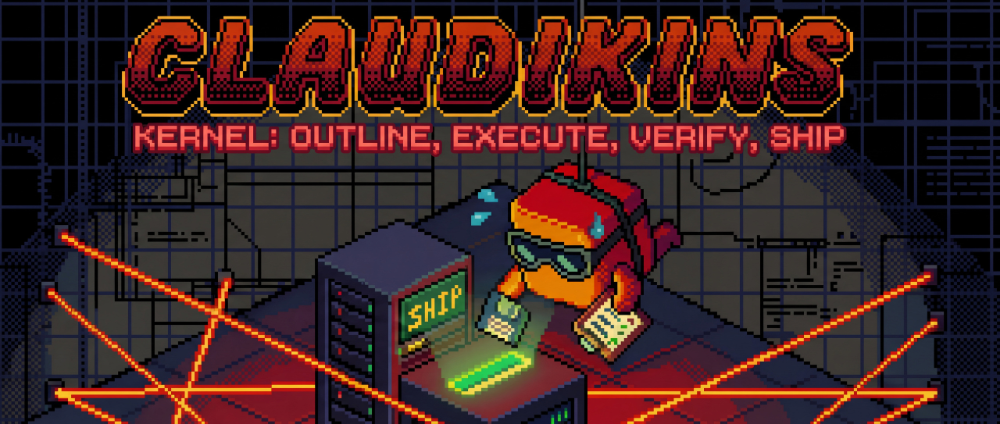

<p align="center">
  
</p>

# Claudikins Kernel

A structured workflow plugin for Claude Code that enforces quality through human checkpoints, isolated agents, and verification gates.

## The Big Picture

You have 4 commands that flow in sequence: `/plan` → `/execute` → `/verify` → `/ship`

Each command has gates that prevent you skipping steps. You can't execute without a plan, can't verify without executed code, can't ship without verification passing. The system enforces this.

---

## /plan - "Let's figure out what we're building"

**Purpose:** Iterative brainstorming with Claude until you have a solid plan.

**How it works:**

1. **Session starts** - Creates a session ID, checks if you have an old session to resume (warns if it's stale - over 4 hours old)

2. **Brain-jam phase** - You and Claude go back and forth. You describe what you want, Claude asks clarifying questions one at a time. Uses AskUserQuestion so you pick from options rather than typing essays. This continues until requirements are clear.

3. **Research phase** - Claude spawns 2-3 "taxonomy-extremist" agents in parallel. These are read-only researchers that dig through your codebase, external docs, or the web depending on what's needed. They return findings, Claude merges them, shows you what was found.

4. **Approaches phase** - Claude presents 2-3 different ways to solve the problem. Each has pros, cons, effort estimate. Claude recommends one. You pick.

5. **Draft phase** - Claude writes the plan section by section. After each section, you approve or request changes. Not batched - one section at a time.

6. **Review phase** - Optionally Klaus (the opinionated debugger) or a plan-reviewer looks at the whole thing and pokes holes.

**Output:** A plan.md file with a task table that /execute can parse. The table has task numbers, descriptions, file lists, dependencies, and batch assignments.

**Key agent:** taxonomy-extremist (Sonnet, read-only, runs in parallel)

---

## /execute - "Let's build it"

**Purpose:** Execute the plan task by task with fresh agents and code review.

**How it works:**

1. **Load & validate** - Parses your plan.md, extracts the task table, builds a dependency graph, figures out which tasks can run in parallel (same batch) vs which must wait (dependencies).

2. **Per-batch loop:**

   - **Batch start checkpoint** - Shows you "Batch 1/3: [task-1, task-2]. Ready?" You can execute, skip tasks, reorder, or pause.

   - **Execute tasks** - For each task, creates a git branch (`execute/task-1-auth-middleware`), spawns a fresh "babyclaude" agent. Babyclaude gets the task description, acceptance criteria, and nothing else. It implements exactly what's asked, runs tests, commits, and outputs a JSON report.

   - **Review tasks** - Two-stage review. First "spec-reviewer" (Haiku, fast) checks: did it do what was asked? Any scope creep? Any missing requirements? If that passes, "code-reviewer" (Opus, thorough) checks: is the code good? Error handling? Edge cases? Clear naming?

   - **Batch review checkpoint** - Shows results table. You can accept, revise specific tasks, retry, or escalate to Klaus.

   - **Merge conflict check** - Before merging, checks if the branch will conflict with main. If so, offers conflict resolution options.

   - **Merge decision** - You decide: merge all, merge some, or keep branches separate.

3. **Context monitoring** - If you hit 75% context usage mid-batch, mandatory stop. Offers handoff to new session.

**Output:** Implemented code on branches (or merged), execute-state.json tracking what was done.

**Key agents:**
- babyclaude (Sonnet, one per task, isolated)
- spec-reviewer (Haiku, mechanical compliance check)
- code-reviewer (Opus, quality judgement)

---

## /verify - "Does it actually work?"

**Purpose:** Claude must SEE the code working, not just trust that tests pass.

**How it works:**

1. **Gate check** - Won't run unless /execute completed. Checks execute-state.json exists.

2. **Automated quality checks:**
   - **Tests** - Runs your test suite. If tests fail, tries again to detect flaky tests. If still fails, you decide: fix, skip, or abort.
   - **Lint** - Runs linter. Can auto-fix if you want.
   - **Type check** - Runs type checker.

3. **Output verification (catastrophiser)** - This is the key bit. Spawns "catastrophiser" agent (Opus, background) that actually runs your code and observes it:
   - **Web app:** Starts dev server, takes screenshots, tests user flows
   - **API:** Curls endpoints, checks responses
   - **CLI:** Runs commands, verifies output
   - **Library:** Runs examples

   Has fallbacks - if can't start server, falls back to tests only, then CLI, then code review.

4. **Code simplification (cynic)** - Optional polish pass. "cynic" agent looks for unnecessary complexity, dead code, unclear naming. Makes changes one at a time, runs tests after each. If tests break, reverts.

5. **Klaus escalation** - If stuck, can escalate to Klaus. If Klaus unavailable, falls back to human review.

6. **Human checkpoint** - Shows comprehensive report. You decide: ready to ship, needs work, or accept with caveats.

**Output:** verify-state.json with `unlock_ship: true` if approved. Also generates a file manifest (SHA256 hashes of all source files) so /ship can detect if code changed after verification.

**Key agents:**
- catastrophiser (Opus, sees code running, captures evidence)
- cynic (Opus, optional polish pass)

---

## /ship - "Send it"

**Purpose:** Merge to main with proper docs, commit messages, and PR.

**How it works:**

1. **Gate check** - Won't run unless /verify passed AND code hasn't changed since. Checks commit hash and file manifest match.

2. **Pre-ship review** - Shows summary of what's being shipped, which branches will merge, verification evidence. You confirm ready.

3. **Commit strategy** - Asks: squash or preserve history? Drafts commit message(s). Section-by-section approval of the message.

4. **Documentation (git-perfectionist)** - Spawns "git-perfectionist" agent (Opus) that uses the GRFP methodology from the github-readme plugin. Updates README if features changed, adds CHANGELOG entry, bumps version number. All section-by-section with your approval.

5. **PR creation** - Drafts PR title and body. Section-by-section approval. Creates PR via `gh` CLI. Has retry logic with exponential backoff if GitHub is flaky.

6. **Final merge** - Waits for CI if you want. Merges when approved. Cleans up feature branches.

**Output:** Code on main, PR merged, branches deleted, version bumped.

**Key agent:** git-perfectionist (Opus, docs updates using GRFP)

---

## The Safety Net

**Cross-command gates:** Each command checks the previous one completed. Can't skip steps.

**State files:** Each command writes state to `.claude/` - plan-state.json, execute-state.json, verify-state.json, ship-state.json. Enables resume if context dies.

**File locking:** All state writes use flock to prevent race conditions if you somehow have parallel sessions.

**Code integrity:** /verify generates file hashes, /ship validates they haven't changed. Can't ship code that wasn't verified.

**Session management:** Session IDs track everything. If you resume a stale session (4+ hours), warns you research might be outdated.

**Human checkpoints:** Every phase has explicit stop points where you choose what happens next. Nothing auto-proceeds without your approval.

---

## Agents

| Agent | Model | Purpose | Used In |
|-------|-------|---------|---------|
| taxonomy-extremist | Opus | Read-only research | /plan |
| babyclaude | Opus | Implement single task | /execute |
| spec-reviewer | Opus | Did it match the spec? | /execute |
| code-reviewer | Opus | Is the code good? | /execute |
| catastrophiser | Opus | See code actually working | /verify |
| cynic | Opus | Polish and simplify | /verify |
| git-perfectionist | Opus | Update docs for shipping | /ship |

---

## Dependencies

**Recommended plugins:**
- `claudikins-tool-executor` - MCP access for research and verification
- `claudikins-automatic-context-manager` - Context monitoring at 60%

**Optional plugins:**
- `claudikins-klaus` - Escalation when stuck
- `claudikins-github-readme` - GRFP methodology for docs

---

## Technical Notes

### Hook Behaviour

Plugin hooks **merge and run in parallel** - they don't replace each other. This means:

- claudikins-tool-executor's SessionStart hooks run
- claudikins-kernel's SessionStart hooks run
- Both execute simultaneously, neither removes the other

All hooks from all enabled plugins are additive. The only conflict scenario is if multiple hooks try to block the same action - but our hooks don't block, they only set up directories and state.

### Design Philosophy

**Industrial-grade patterns adapted for Claude Code.**

The git-workflow skill draws from distributed systems engineering (microservices, Kubernetes, SRE practices) but adapts these patterns for Claude Code's agent-based execution:

| Distributed Systems Pattern | Claude Code Adaptation |
|-----------------------------|------------------------|
| Circuit breakers | Stuck agent detection |
| Distributed tracing | Execution spans |
| Load shedding | Batch size limits |
| Coordinated checkpoints | Batch-boundary saves |
| Deadline propagation | Task time budgets |
| Exponential backoff | Retry with jitter |

Same principles, different scale. The goal is reliability through structure - not speed through parallelism.

---

## Installation

### System Requirements

- `jq` - Command-line JSON processor (used by hook scripts)
  ```bash
  # Ubuntu/Debian
  sudo apt install jq

  # macOS
  brew install jq

  # Windows (via scoop)
  scoop install jq
  ```

### Plugin Installation

```bash
# Clone into your Claude Code plugins directory
git clone https://github.com/elb-pr/claudikins-kernel ~/.claude/plugins/claudikins-kernel
```

---

## Status

Planning complete. Implementation pending.

See `docs/plans/` for detailed architecture documents.

---

## License

MIT
